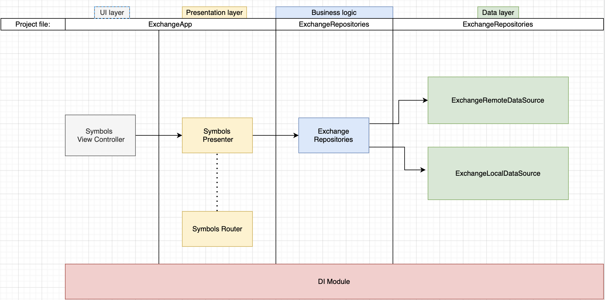

# Blockchain.com Exchange app.

## Environment info: 
    Xcode: Version 13.1 (13A1030d)
    Xcodegen: Version: 2.18.0
    Dependency menagment system: Swift Package Manager 

## Main 3rd party dependencies: 
    https://github.com/ReactiveX/RxSwift
    https://github.com/square/Cleanse
    https://github.com/danielgindi/Charts
    
## Dependencies installation: 

    All dependencies required in project are lister in Brewfile.
    To install all dependencies execute command from folder where Brewfile is visible:

    ```
        brew bundle
    ```
    
## Scripts folder: 
    ```
    ./buildProjectFiles.sh - generate all projects
    ./preBuildScript.sh - swiftlint prebuild phase script
    ```

## Project: 
    Project contains 4 main modules wich are represented by seprate project files. 
    Script folder will help you generate all xcodeproj files.
    
    ExchangeLocalDataSource  - api client https://api.blockchain.com
    ExchangeRemoteDataSource - stores cache as files
    ExchangeSymbolsRepository - business logic layer, coordinates work between datasources
    ExchangeApp - main app module with presentation layer

## TDD:
    ExchangeRemoteDataSource is the only module that contains unit and integration tests
    There was no time to provide more tested code but all classes are testable.

## Simplified architecture diagram: 


## Project features: 
    - fetch data from symbols endpoint
    - cache data from symbols endpoint and return cache data when there is no connection
    - fetch data from prices endpoint
    - if no connection fetch prices should return empty array
    - show prices as a chart view
    
## Ideas for improvment: 
    - should be one more UseCases module/layer as an app will grow in complexity
    - RxSwift, Cleanse are quite fat third party dependency across modules
    - NetworkInfo should be separate datasource module
    - some error handling code in presenters is not implemented
    - no fastline/ci
    - use carthage+rome for better framework managment

## Known issues:
    - There might be a crash in unit tests, related to SPM embeding two RxSwift framework to test budnle
